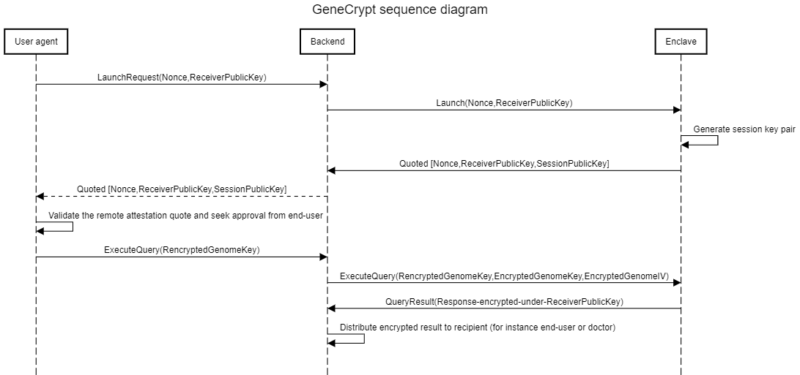

# GeneCrypt

This is the source code for my entry into the Confidential Computing Challenge. Try out the running application at https://genecrypt.thiim.net/. I didn't win but ended up getting an honorable mention: https://cloud.google.com/blog/products/identity-security/announcing-the-winners-of-the-confidential-computing-challenge.

My LinkedIn profile: https://www.linkedin.com/in/martinthiim

## Background

(This is the essay as I submitted it to the competition)

This proposal solves the problem of protecting genomic data so that it is under full control of the user while ensuring it can still be put to full use.
The availability of genome sequencing will open the era of personalized medicine. However, a major hindrance could prove to be privacy concerns. 
Today, patients have little control over their health data. At best, they can give coarse-grained consent to data sharing and hope that their wishes are respected and that the data is protected.
For genomic data, it is critical to develop means that give users end-to-end control of their data. Not only will this increase security, but it will also enable more wide-spread use of this valuable resource, since it becomes more acceptable to give access if it is selective, compared to today’s all-or-nothing approaches. 
My proposal utilizes confidential computing principles, and particularly Asylo/SGX enclaves, to realize this. Briefly, I propose encrypting genomic data under a key only the user controls. The user initially generates a key pair, using e.g. a mobile app. Whenever genomic data is produced for this user it is encrypted under a fresh symmetric key that is in turn encrypted under this public key. Ideally, this would happen in the sequencing equipment itself. 
The encrypted key and genome is returned and stored in the "gene bank", which will thus be unable to access the data. However, the bank can pass the data to enclaves that can then ask for the user’s permission to access the data. The user will see and approve such requests on their mobile device. The device will use remote attestation to be able to present the identity of the requesting enclave and to verify the integrity of the platform. The key will only be released in case the user approves and only to the attested and approved enclave. The enclave will carry out its analysis and return only the final result, encrypted under a key provided to it is as an initialization parameter (and also attested). Hence, the user also has full control over who receives the analysis result.
In real life, a doctor might recommend a patient to be screened for a mutation associated with some disease. Using GeneCrypt, the doctor could submit to the gene bank to have a specific enclave analyze the genome. This would trigger the user receiving a push notification on their mobile device, which would attest the requesting enclave and provide the detailed enclave information to the user: What does the enclave do, who developed it, what does it return, who gets the result, etc.
Enclaves might be signed by medical authorities and stored in designated repositories along with full source code history. The flexibility of enclaves ensures all use cases can be covered: Some enclaves might screen for diseases, others might extract and re-encrypt a specific gene for manual analysis. 
The cryptographic aspects have been deliberately kept to illustrate the concept more clearly. More refined protocols would be used in practice.

## Building and running
In the following, it is described how to build and run the application from source.

The application consists of two main parts: the GeneCrypt backend application and the Asylo enclave and host driver which is used by the backend application.
Both are stored in this repo.

The descriptions below assume that Maven and Docker have already been installed.

### The backend database

The application uses a [MongoDB](https://www.mongodb.com/) database for storing the user genomes and keys.

To easily launch a MongoDB instance, use (data will be stored in `~/data` directory):

```
docker run -d -p 27017:27017 -v ~/data:/data/db mongo
```

The default configuration of the application expects to access this database on `127.0.0.1` port `27017` and will thus work with the database started as above. However, you can override the address the address as explained below.

### The backend application

The backend application is a Spring Boot application. This application contains and serves the frontend index.html and associated JavaScript code.
The application can be built using Maven, by executing:

```
mvn clean install
```

from the root of the checkout. You can add the command line option `dockerfile:build` if you wish to build a Docker image.

You can run the application directly from the command line:

```
java -jar target/gcbackend-1.0.0-SNAPSHOT.jar
```

In this configuration, it will use a Java-simulation of the enclave system.  See [below](#use-of-asylo-enclaves)
for instructions how to build and enable use of the Asylo enclave.

If you wish to use another database host than `127.0.0.1:27017` you can add the option `--spring.data.mongodb.uri=<uri>` where `<uri>` could be e.g. `mongodb://127.0.0.1:27017/test`. If you started the MongoDB Docker image as per the above, it will just work.

The server will by default listen on port `8080` but this can be modified using `--server.port=<port>`.

**Note that because the frontend part uses Web Crypto API, the page will need to be served either from `localhost` or `127.0.0.1` or from an HTTPS protected domain, otherwise the browser will not permit the WebCrypto calls.**

### Use of Asylo enclaves

The backend application internally defines an `IEnclaveSystem` Java interface. There are two implementations:
`JavaSimEnclaveSystemImpl` is a 100% Java implementation and is thus useful for debugging the rest of the setup, whereas `AsyloEnclaveSystemImpl` works with actual Asylo enclaves. It works by launching the enclave driver process and communicating with it using stdio (in a production
version this should of course be handled by JNI). Note that separate processes are started for all enclave launches and the processes are kept running for 5 minutes so they can satisfy `executeQuery` requests (due to the cryptographic protocol used, the enclave
holds state between the `launch` and the `executeQuery` call, in particular the session key). 

The root of the repository is a Bazel workspace. The Asylo enclave and driver is stored in the "genecrypt" subdirectory. To build the enclaves you can run:

```
export MY_PROJECT=/path/to/<REPO_CHECKOUT>
docker run -it --rm     -v bz:/root/.cache/bazel     -v "${MY_PROJECT}":/opt/my-project     -w /opt/my-project     gcr.io/asylo-framework/asylo     bazel build --config=enc-sim  //genecrypt
```

After building, the enclaves are stored inside the Docker volume. You can export the enclaves to the `./enclaves` subdirectory using:

```
docker run -it --rm     -v bz:/root/.cache/bazel     -v "${MY_PROJECT}":/opt/my-project     -w /opt/my-project -v "${MY_PROJECT}/enclaves":/enclaves    gcr.io/asylo-framework/asylo  cp -r bazel-bin/genecrypt /enclaves
```

When starting the application, you need to specify that you wish to use the Asylo-enclave. This is done by adding the Spring profile `asylo` as follows (this enables `AsyloEnclaveSystemImpl` as mentioned above):

```
java -Dspring.profiles.active=asylo -jar target/gcbackend-1.0.0-SNAPSHOT.jar
```

The application per default expects to find the enclave and driver in the `./enclaves` sub-directory and will use the command `./genecrypt/genecrypt` for launching the driver, which matches the location if you followed the guide above. 
However, you can override the location and executable name using the `--enclave.dir=<dir>` and `--enclave.cmd=<cmd>` on the command line or changing the values in `src/main/resources/application.properties`.

To build the Intel SGX version, use `--config=sgx` instead in the build step above. The enclave running on the sample website https://genecrypt.thiim.net is using the `enc-sim` variant, since SGX is not supported by Google cloud. But I have tested the whole setup and verified that the enclave works under SGX.
  
## Remote attestation

This PoC doesn't use real remote attestation, since this feature is not available in Asylo yet.
However, using remote attestation is a critical feature for production use, especially to ensure that the data returned from the launch step is generated by a trusted enclave running on secure hardware, before encrypting the genome key under the session public key
provided by the enclave. However, for this PoC I have merely simulated the principle of remote attestation by having the backend (the `QuotingSimulator` class) create a signature on the output from the initial launch-response from the enclave (which contains key parameters such as the session public key of the session key pair generated by the enclave, the public that will be used to encrypt the result and the nonce). This signature is then verified the JavaScript side. The action of `QuotingSimulator` is intended to approximate what e.g. the SGX remote attestation does although the EPID-scheme in particular is much more complicated due to the extra privacy protections offered. However, these protections are not particularly relevant to this use case because it is the data center's "privacy" we would be protecting, not that of the end-user. So the DCAP scheme for SGX would be fully sufficient for this use case.

## Aspects related to the initial encryption of the genomic data
There exists a vulnerable period of time from when the raw genomic data has been produced by the sequencing
equipment (based on e.g. a biological sample) and until it is encrypted under the end-user key. This is
an inherent problem to any solution, due to the information originating from a biological sample rather than from some
computational context. My suggestion is that this takes place as close to the sequencing process, i.e. inside
the sequencing equipment itself. Note that this equipment does not need to run an enclave, it merely needs to be able to encrypt the data under a specific public key, so now special hardware is required. The public key could be entered into the equipment (either manually or through some protocol) upon start of sequencing, or could even be indicated on the container for the sample to be sequenced (QR code etc.). 
Most sequencing protocols will sequence the genome in small strands that are then later stitched together through a computationally process. One could imagine the sequencing equipment returning the individual encrypted strands which would later be stitched together inside a stitcher-enclave (upon approval from the end-user).

## Use of sealing
This PoC doesn't use Asylo or SGX features for sealing data and doesn't strictly require them for security, since the genome is encrypted under a key known only to the end-user and is released only to the specific enclaves that the end-user approves to run on their genome. This is opposed to a model where, say, the data is sealed to some enclave or to some signer of enclaves that would then have access (but wouldn't require approval for each run).
However, sealing could still be added as an security additional layer. One could imagine the genome being sealed by a special "import/export enclave". The end-user approval would entail approving (towards the import/eport enclave) that a portion of their genome (for instance, the relevant gene(s)) would be exported and re-encrypted, under some other session key negotiated with the analysis-specific "processing enclave". The processing enclaves wouldn't need to be signed by the same signer as the "import/processing enclave" - instead, the end-user would negotiate the key with the processing enclave (using remote attestation, very much like in this PoC) and provide the session public key as a parameter to the extraction enclave. This scheme would ensure two levels of security of the data. In particular, the extraction enclave could enforce additional security policies. I decided not to implement this scheme in the PoC, so as to not complicate the demonstration of the concept. 
 
## Protocol

The protocol used is quite simple. Many refinements are possible for a production version. In this PoC, executing a query using an enclave involves two steps: First the enclave must be launched. It is provided with two launch parameters: a nonce (generated by the requestor) and the public key of the intended recipient. The enclave's response will be encrypted under this public key. During the launch step, the enclave generates a RSA-2048 key pair which is used as a session key pair for this request. The enclave retains the private key in internal storage. It returns a quoted version the public key along with the launch parameters (nonce and public key of requested). The quote should be made so that the remote party (namely, the end-user) will be able to validate that the quoted data originates from an enclave the end-user trusts, running in a secure environment. In this way, the end-user can be sure that the session public key comes from a key pair that was securely generated inside the enclave and thus that it is safe to communicate the genome encryption key, encrypted under this public key. The end-user's agent software (e.g. mobile app) can validate the parameters and present the request to the end-user in a meaningful way. If the end-user approves, the genome encryption key is encrypted under the public key, and submitted to the backend that can then provide it in a   ``executeQuery``  to the enclave, along with the encrypted genome itself (and IV).. The enclave - knowing the private key for the session key pair - can decrypt the genome key, and hence the genome, allowing it to perform its analysis. The analysis result is then encrypted under the public key that was provided in the initial step, and is now only accessible to the designated recipient.
 

## About the author
My name is Martin Thiim. I hold an M.Sc. in Bioinformatics (2007) and a B.Sc. in Computer Science and Mathematics (2005). I work as a lead architect on Denmark's eID system NemID and on the successor system MitID. I believe the protection of genetic data is an excellent use
case for confidential computing since it's an area where the data processed is highly sensitive but where
raw access to the whole data is rarely required by patients or doctors. Usually, some specific
information is sought and this information can be produced by executing an algorithm on the raw data. This
execution might well take place inside an enclave, under the permission and control of the end-user.
[LinkedIn profile](https://www.linkedin.com/in/martinthiim)  
